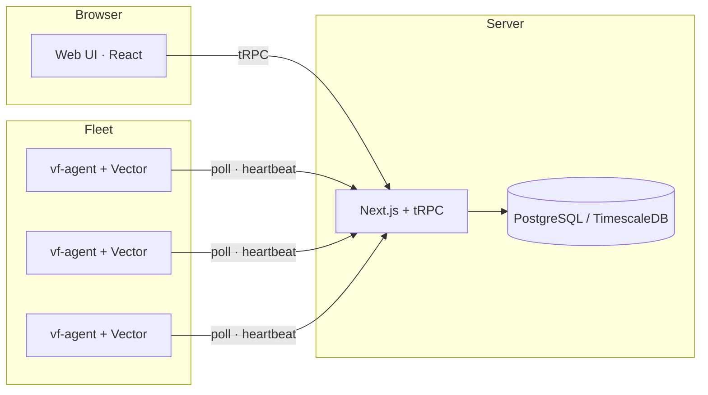

<div align="center">

<picture>
  <source media="(prefers-color-scheme: dark)" srcset="assets/logo-dark.svg">
  <source media="(prefers-color-scheme: light)" srcset="assets/logo-light.svg">
  
</picture>
<br><br>

[](https://github.com/TerrifiedBug/vectorflow/actions/workflows/ci.yml)
[](https://github.com/TerrifiedBug/vectorflow/releases)
[](LICENSE)
[](https://vectorflow.sh/docs)

Design, deploy, and monitor [Vector](https://vector.dev) data pipelines visually.

Stop hand-editing YAML. Build observability pipelines with drag-and-drop<br>and deploy them across your fleet from a single dashboard.

[Documentation](https://vectorflow.sh/docs) · [Quick start](#quick-start) · [Deployment](#deployment) · [Features](#features) · [Configuration](#configuration) · [Development](#development)

> 🌐 **[Try the live demo →](https://demo.vectorflow.sh)**

</div>

<br>

<p align="center">
  
</p>

## Why VectorFlow?

[Vector](https://vector.dev) is great at moving observability data around, but managing YAML configs across dozens of servers gets painful fast. VectorFlow is a self-hosted control plane that lets you build pipelines visually, push them to a fleet of agents, and monitor everything in real time.

- Self-hosted, open source, runs on your infrastructure. No vendor lock-in.
- Pull-based agents, so no inbound ports needed on fleet nodes.
- Per-pipeline process isolation. A crashed pipeline doesn't take down the others.

## Features

### Visual pipeline editor

Build Vector pipelines on a drag-and-drop canvas. The sidebar has 100+ components you can wire together, each configurable through schema-driven forms. The VRL editor has Monaco syntax highlighting, a snippet library, and live schema discovery.

- Connection validation prevents invalid data type connections at edit time
- Import existing `vector.yaml` files or export as YAML/TOML
- Save and reuse pipeline patterns as templates across your team
- Tap into running pipelines to sample actual events flowing through

### Fleet deployment

Deploy pipeline configs to your fleet with a single click. The deploy dialog shows a full YAML diff against the previous version before you confirm. Agents pull configs automatically; no SSH, no Ansible, no manual steps.

<p align="center">
  
</p>

### Real-time monitoring

Track pipeline throughput, error rates, and host metrics (CPU, memory, disk, network) per node and per pipeline. Live event rates show directly on the pipeline canvas while you edit.

<p align="center">
  
</p>

### Version control and rollback

Every deployment creates an immutable version snapshot with a changelog. Browse the full history, diff any two versions, and roll back in one click. Promote pipelines between environments (e.g., staging to production) with secret reference warnings.

### Enterprise security

- OIDC SSO with Okta, Auth0, Keycloak, or any OIDC provider, with group-to-role mapping
- TOTP 2FA, optional per-user and enforceable per-team
- RBAC with Viewer, Editor, Admin roles scoped per team
- Encrypted secrets at rest using AES-256-GCM, referenced from pipeline configs as `SECRET[name]`
- TLS cert storage referenced directly in pipeline configs
- Immutable audit log of every action with before/after diffs

### Alerting and notifications

Threshold-based alert rules on CPU, memory, disk, error rates, throughput drops, deploy events, version drift, certificate expiry, and more. Notifications deliver to native Slack, email, and PagerDuty channels, plus HMAC-signed generic webhooks for anything else (Discord, Teams, custom HTTP endpoints).

### Anomaly detection

Statistical baselines per pipeline detect throughput, error-rate, and latency anomalies without manual thresholds. Anomalies feed the same alert correlation groups as rule-based alerts so a single incident doesn't fan out into noise.

### Cost attribution and optimization

Per-pipeline, per-team, and per-environment cost rollups based on event volume. The optimizer flags low-reduction transforms, high-error pipelines, and stale configs, with one-click apply (or dismiss) of recommendations.

### GitOps and automation

Sync pipeline definitions from Git (GitHub, GitLab, Bitbucket) with PR-based promotion between environments. Bearer-token REST API and SCIM 2.0 user provisioning for platform-team workflows.

### AI debugging

Optional AI suggestions for failing pipelines: feed pipeline metrics, recent deploys, and SLI breaches into a model to surface likely causes. Bring your own OpenAI/Anthropic key.

## Architecture



The server is a Next.js app with tRPC for the API, Prisma ORM with PostgreSQL-compatible databases, and NextAuth for authentication. The Docker Compose stack uses TimescaleDB on PostgreSQL 16 so metrics hypertables are available; plain PostgreSQL is also supported with slower retention cleanup. The server bundles a local Vector binary for config validation and VRL testing.

The agent (`vf-agent`) is a single Go binary that runs alongside Vector on each managed host. It polls the server for config updates, manages per-pipeline Vector processes, and reports health via heartbeats. No external dependencies beyond Vector itself.

## Quick start

### 1. Start the server

```bash
git clone https://github.com/TerrifiedBug/vectorflow.git
cd vectorflow/docker/server

# Create environment file
cat > .env << 'EOF'
POSTGRES_PASSWORD=changeme
NEXTAUTH_SECRET=generate-a-random-32-char-string-here
EOF

docker compose up -d
```

The quick start uses convenience defaults. Before adapting it for production, review the [production hardening guide](https://vectorflow.sh/docs/operations/production-hardening).

Open [http://localhost:3000](http://localhost:3000). The setup wizard creates your admin account.
Set `NEXTAUTH_URL` in `.env` before any non-local deployment so OAuth callbacks and generated links use your public URL.

### 2. Enroll your first agent

In the UI, go to **Environments → Generate Enrollment Token**, then on each target host:

```bash
cd vectorflow/docker/agent

cat > .env << 'EOF'
VF_URL=http://your-vectorflow-server:3000
VF_TOKEN=paste-enrollment-token-here
EOF

docker compose up -d
```

Or run the binary directly:

```bash
VF_URL=http://your-server:3000 VF_TOKEN=<token> ./vf-agent
```

### 3. Build your first pipeline

1. Go to **Pipelines → New Pipeline**
2. Drag a source (e.g., Syslog) from the component palette
3. Add a transform (e.g., Remap) and write VRL to shape your data
4. Connect to a sink (e.g., Elasticsearch, S3, Loki)
5. Click **Deploy**, review the YAML diff, and confirm

Your pipeline is now running across all enrolled nodes.

## Deployment

### Server

Run the VectorFlow server with Docker Compose:

```bash
cd vectorflow/docker/server
docker compose up -d
```

The Compose stack starts `timescale/timescaledb:latest-pg16`. Keep the `postgres` service name in `DATABASE_URL`; it is the Compose hostname for the TimescaleDB/PostgreSQL container.

Before running Docker Compose in production, review the [production Docker and Helm hardening guide](https://vectorflow.sh/docs/operations/production-hardening). It covers the default all-interface server port, moving image tags, agent host networking, and host access settings.

For a two-replica high-availability stack behind nginx, use the HA Compose file:

```bash
cd vectorflow/docker/server
docker compose -f docker-compose.ha.yml up -d
```

The HA stack runs `vf1` and `vf2` behind nginx, with Redis for cross-instance coordination. Both app replicas and nginx expose Docker healthchecks against `/api/health/ready`; nginx waits for at least one app replica to report ready before it starts accepting traffic, then retries failed or unready upstreams against the other replica.

See [Configuration → Server](#configuration) for all available environment variables.

### Agent

#### Option A: Docker

The simplest way to run the agent, and ideal for containerized environments:

```bash
cd vectorflow/docker/agent

cat > .env << 'EOF'
VF_URL=http://your-vectorflow-server:3000
VF_TOKEN=paste-enrollment-token-here
EOF

docker compose up -d
```

#### Option B: Standalone binary (Linux)

Install the agent as a native systemd service. The install script downloads the binary, installs Vector if needed, and configures everything:

```bash
curl -sSfL https://raw.githubusercontent.com/TerrifiedBug/vectorflow/main/agent/install.sh | \
  sudo bash -s -- --url https://vectorflow.example.com --token <enrollment-token>
```

Managing the service:

```bash
systemctl status vf-agent          # Check status
journalctl -u vf-agent -f          # Follow logs
sudo systemctl restart vf-agent    # Restart
```

Upgrading:

```bash
# Upgrade to the latest release
curl -sSfL https://raw.githubusercontent.com/TerrifiedBug/vectorflow/main/agent/install.sh | sudo bash

# Install a specific version
curl -sSfL https://raw.githubusercontent.com/TerrifiedBug/vectorflow/main/agent/install.sh | \
  sudo bash -s -- --version v0.3.0
```

Existing configuration at `/etc/vectorflow/agent.env` is preserved during upgrades.
The installer also accepts `--channel stable` or `--channel dev` when selecting the release channel. That is an installer option, not a `vf-agent` runtime flag; configure the running agent with environment variables instead.

Uninstalling:

```bash
sudo systemctl stop vf-agent
sudo systemctl disable vf-agent
sudo rm /etc/systemd/system/vf-agent.service
sudo systemctl daemon-reload
sudo rm /usr/local/bin/vf-agent
sudo rm -rf /var/lib/vf-agent /etc/vectorflow
```

#### Option C: Manual binary

Download the binary from [Releases](https://github.com/TerrifiedBug/vectorflow/releases) and run it directly:

```bash
VF_URL=http://your-server:3000 VF_TOKEN=<token> ./vf-agent
```

See [Configuration → Agent](#configuration) for all available environment variables.

For Kubernetes deployments, see the [Helm charts](charts/README.md) and review the [production hardening guide](https://vectorflow.sh/docs/operations/production-hardening) before keeping host networking, host log mounts, or elevated file-read capabilities enabled.

### API documentation

Logged-in users can view the Swagger UI at `/api/v1/docs`. The machine-readable OpenAPI 3.1 document is served from `/api/v1/openapi.json` and requires a valid NextAuth session; unauthenticated requests return `401 Unauthorized`.

## Tech stack

| Layer | Technology |
|-------|-----------|
| Frontend | Next.js 16, React 19, TypeScript, Tailwind CSS 4, shadcn/ui |
| Flow Editor | React Flow (@xyflow/react) |
| Code Editor | Monaco Editor (VRL syntax) |
| API | tRPC 11 (end-to-end type safety) |
| Database | PostgreSQL-compatible database + Prisma 7; Docker Compose uses TimescaleDB on PostgreSQL 16 |
| Auth | NextAuth 5 (credentials + OIDC) |
| Agent | Go 1.22 (zero dependencies, single binary) |
| Data Engine | Vector 0.54.0 |

## Configuration

### Server

| Variable | Required | Default | Description |
|----------|----------|---------|-------------|
| `DATABASE_URL` | Yes | — | PostgreSQL-compatible connection string |
| `NEXTAUTH_SECRET` | Yes | — | Session and encryption key (32+ chars) |
| `NEXTAUTH_URL` | Recommended | — | Canonical server URL for OAuth callbacks and generated external links |
| `AUTH_TRUST_HOST` | Compose default | `true` in Docker Compose | Allows NextAuth to infer the host from trusted request headers when `NEXTAUTH_URL` is unset |
| `PORT` | No | `3000` | HTTP listen port |

### Agent

| Variable | Required | Default | Description |
|----------|----------|---------|-------------|
| `VF_URL` | Yes | — | VectorFlow server URL |
| `VF_TOKEN` | First run | — | One-time enrollment token |
| `VF_DATA_DIR` | No | `/var/lib/vf-agent` | Data directory |
| `VF_VECTOR_BIN` | No | `vector` | Path to Vector binary |
| `VF_POLL_INTERVAL` | No | `5s` | Bootstrap config poll frequency before server fleet settings load |
| `VF_LOG_FLUSH_INTERVAL` | No | `2s` | Buffered log flush frequency |
| `VF_LOG_LEVEL` | No | `info` | Logging level |
| `VF_NODE_LABELS` | No | — | Node labels as comma-separated `key=value` pairs |
| `VF_METRICS_PORT` | No | `9090` | Agent self-metrics Prometheus port; set `0` to disable |

### Fleet settings (admin UI)

| Setting | Default | Description |
|---------|---------|-------------|
| Poll interval | 15s | Agent config check frequency |
| Unhealthy threshold | 3 missed | Heartbeats before marking node unhealthy |
| Metrics retention | 7 days | Time-series data retention |
| Logs retention | 3 days | Pipeline log retention |

The agent uses `VF_POLL_INTERVAL` only until it receives fleet settings from the server. After that, the fleet poll interval above controls the steady-state config check frequency.

## Development

### Prerequisites

- Node.js 22+ and pnpm
- PostgreSQL 16+ or TimescaleDB on PostgreSQL 16
- Go 1.22+ (agent only)

### Server

```bash
pnpm install
pnpm dev
```

### E2E release gate

See [docs/e2e-release-gate.md](docs/e2e-release-gate.md) for the Docker-backed
Playwright gate covering setup, browser authentication, pipeline creation,
deploy flow, fleet health, and the activation-path smoke.

### Maintainer docs

- [Deploy state machine](https://vectorflow.sh/docs/operations/deploy-state-machine)
  covers deploy approvals, version snapshots, rollback, concurrent deploy
  resolution, agent config delivery, and heartbeat status transitions.

### Agent

```bash
cd agent
make build        # Current platform
make build-all    # Cross-compile linux/amd64 + linux/arm64
```

## Contributing

Contributions are welcome. See [SECURITY.md](SECURITY.md) for reporting security vulnerabilities.

## License

VectorFlow is licensed under the [GNU Affero General Public License v3.0](LICENSE) (AGPL-3.0).

Copyright &copy; 2026 TerrifiedBug
