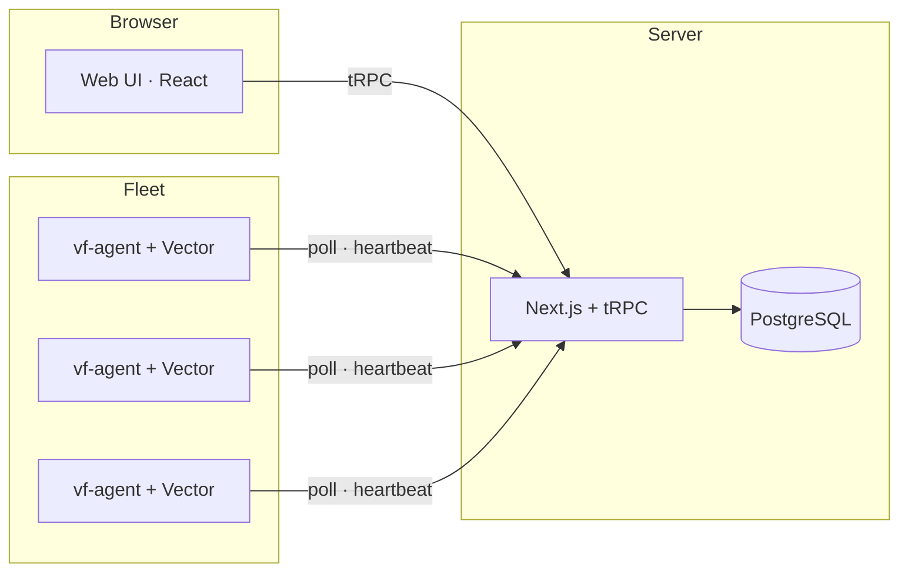

<div align="center">

<picture>
  <source media="(prefers-color-scheme: dark)" srcset="assets/logo-dark.svg">
  <source media="(prefers-color-scheme: light)" srcset="assets/logo-light.svg">
  
</picture>

<br><br>

[](https://github.com/TerrifiedBug/vectorflow/actions/workflows/ci.yml)
[](https://github.com/TerrifiedBug/vectorflow/releases)
[](LICENSE)

**🔀 Design, deploy, and monitor [Vector](https://vector.dev) data pipelines — visually**

Stop hand-editing YAML. Build observability pipelines with drag-and-drop<br>and deploy them across your entire fleet from a single dashboard.

[Quick Start](#-quick-start) · [Deployment](#-deployment) · [Features](#-features) · [Configuration](#%EF%B8%8F-configuration) · [Development](#-development)

</div>

<br>

<!-- TODO: Add hero screenshot — drag the pipeline editor screenshot into a GitHub issue to get a CDN URL, then uncomment:
<p align="center">
  
</p>
-->

## Why VectorFlow?

[Vector](https://vector.dev) is a high-performance observability data pipeline — but managing YAML configs across dozens of servers gets painful fast. VectorFlow is a self-hosted control plane that lets you visually build pipelines, deploy them to a fleet of agents, and monitor everything in real time.

- **No vendor lock-in** — self-hosted, open source, runs on your infrastructure
- **Pull-based agents** — no inbound ports required on fleet nodes
- **Per-pipeline process isolation** — a crashed pipeline doesn't take down the others

## ✨ Features

### 🎨 Visual Pipeline Editor

Build Vector pipelines with a drag-and-drop canvas. Browse 100+ components from the sidebar, wire them together, and configure each one with schema-driven forms. The built-in VRL editor features Monaco-powered syntax highlighting, a snippet library, and live event schema discovery.

- **Connection validation** — prevents invalid data type connections at edit time
- **Import/Export** — import existing `vector.yaml` files or export as YAML/TOML
- **Templates** — save and reuse pipeline patterns across your team
- **Live sampling** — tap into running pipelines to see actual events flowing through

### 🚀 Fleet Deployment

Deploy pipeline configs to your entire fleet with a single click. The deploy dialog shows a full YAML diff against the previous version before you confirm. Agents pull configs automatically — no SSH, no Ansible, no manual intervention.

<!-- TODO: Add pipeline list screenshot -->

### 📊 Real-Time Monitoring

Track pipeline throughput, error rates, and host metrics (CPU, memory, disk, network) per node and per pipeline. Live event rates display directly on the pipeline canvas while you're editing.

<!-- TODO: Add node detail screenshot -->

### 🔄 Version Control & Rollback

Every deployment creates an immutable version snapshot with a changelog. Browse the full history, diff any two versions, and roll back in one click. Promote pipelines between environments (e.g., staging → production) with secret reference warnings.

### 🔒 Enterprise Security

- **OIDC SSO** — Okta, Auth0, Keycloak, or any OIDC provider with group-to-role mapping
- **TOTP 2FA** — optional per-user, enforceable per-team
- **RBAC** — Viewer, Editor, Admin roles scoped per team
- **Encrypted secrets** — AES-256-GCM at rest; HashiCorp Vault and AWS Secrets Manager backends
- **Certificate management** — TLS cert storage referenced directly in pipeline configs
- **Audit log** — immutable record of every action with before/after diffs

<!-- TODO: Add audit log screenshot -->

### ⚡ Alerting & Webhooks

Set threshold-based alert rules on CPU, memory, disk, error rates, and more. Deliver notifications via HMAC-signed webhooks to Slack, Discord, PagerDuty, or any HTTP endpoint.

<!-- TODO: Add alerts screenshot -->

## 🏗️ Architecture



The **server** is a Next.js application with tRPC for the API, Prisma ORM with PostgreSQL, and NextAuth for authentication. It bundles a local Vector binary for config validation and VRL testing.

The **agent** (`vf-agent`) is a single-binary Go daemon that runs alongside Vector on each managed host. It polls the server for config updates, manages per-pipeline Vector processes, and reports health via heartbeats. Zero external dependencies.

## 🚀 Quick Start

### 1. Start the server

```bash
git clone https://github.com/TerrifiedBug/vectorflow.git
cd vectorflow/docker/server

# Create environment file
cat > .env << 'EOF'
POSTGRES_PASSWORD=changeme
NEXTAUTH_SECRET=generate-a-random-32-char-string-here
EOF

docker compose up -d
```

Open [http://localhost:3000](http://localhost:3000) — the setup wizard creates your admin account.

### 2. Enroll your first agent

In the UI, go to **Environments → Generate Enrollment Token**, then on each target host:

```bash
cd vectorflow/docker/agent

cat > .env << 'EOF'
VF_URL=http://your-vectorflow-server:3000
VF_TOKEN=paste-enrollment-token-here
EOF

docker compose up -d
```

Or run the binary directly:

```bash
VF_URL=http://your-server:3000 VF_TOKEN=<token> ./vf-agent
```

### 3. Build your first pipeline

1. **Pipelines → New Pipeline**
2. Drag a source (e.g., Syslog) from the component palette
3. Add a transform (e.g., Remap) and write VRL to shape your data
4. Connect to a sink (e.g., Elasticsearch, S3, Loki)
5. Click **Deploy** — review the YAML diff and confirm

Your pipeline is now running across all enrolled nodes.

## 📦 Deployment

### Server

Run the VectorFlow server with Docker Compose:

```bash
cd vectorflow/docker/server
docker compose up -d
```

See [Configuration → Server](#%EF%B8%8F-configuration) for all available environment variables.

### Agent

#### Option A: Docker

The simplest way to run the agent — ideal for containerized environments:

```bash
cd vectorflow/docker/agent

cat > .env << 'EOF'
VF_URL=http://your-vectorflow-server:3000
VF_TOKEN=paste-enrollment-token-here
EOF

docker compose up -d
```

#### Option B: Standalone Binary (Linux)

Install the agent as a native systemd service. The install script downloads the agent binary, installs Vector if needed, and configures everything automatically:

```bash
curl -sSfL https://raw.githubusercontent.com/TerrifiedBug/vectorflow/main/agent/install.sh | \
  sudo bash -s -- --url https://vectorflow.example.com --token <enrollment-token>
```

**Managing the service:**

```bash
systemctl status vf-agent          # Check status
journalctl -u vf-agent -f          # Follow logs
sudo systemctl restart vf-agent    # Restart
```

**Upgrading:**

```bash
# Upgrade to the latest release
curl -sSfL https://raw.githubusercontent.com/TerrifiedBug/vectorflow/main/agent/install.sh | sudo bash

# Install a specific version
curl -sSfL https://raw.githubusercontent.com/TerrifiedBug/vectorflow/main/agent/install.sh | \
  sudo bash -s -- --version v0.3.0
```

Existing configuration at `/etc/vectorflow/agent.env` is preserved during upgrades.

**Uninstalling:**

```bash
sudo systemctl stop vf-agent
sudo systemctl disable vf-agent
sudo rm /etc/systemd/system/vf-agent.service
sudo systemctl daemon-reload
sudo rm /usr/local/bin/vf-agent
sudo rm -rf /var/lib/vf-agent /etc/vectorflow
```

#### Option C: Manual Binary

Download the binary from [Releases](https://github.com/TerrifiedBug/vectorflow/releases) and run it directly:

```bash
VF_URL=http://your-server:3000 VF_TOKEN=<token> ./vf-agent
```

See [Configuration → Agent](#%EF%B8%8F-configuration) for all available environment variables.

## 🛠️ Tech Stack

| Layer | Technology |
|-------|-----------|
| Frontend | Next.js 16, React 19, TypeScript, Tailwind CSS 4, shadcn/ui |
| Flow Editor | React Flow (@xyflow/react) |
| Code Editor | Monaco Editor (VRL syntax) |
| API | tRPC 11 (end-to-end type safety) |
| Database | PostgreSQL 17 + Prisma 7 |
| Auth | NextAuth 5 (credentials + OIDC) |
| Agent | Go 1.22 (zero dependencies, single binary) |
| Data Engine | Vector 0.44.0 |

## ⚙️ Configuration

### Server

| Variable | Required | Default | Description |
|----------|----------|---------|-------------|
| `DATABASE_URL` | Yes | — | PostgreSQL connection string |
| `NEXTAUTH_SECRET` | Yes | — | Session & encryption key (32+ chars) |
| `NEXTAUTH_URL` | No | — | Canonical server URL |
| `PORT` | No | `3000` | HTTP listen port |

### Agent

| Variable | Required | Default | Description |
|----------|----------|---------|-------------|
| `VF_URL` | Yes | — | VectorFlow server URL |
| `VF_TOKEN` | First run | — | One-time enrollment token |
| `VF_DATA_DIR` | No | `/var/lib/vf-agent` | Data directory |
| `VF_VECTOR_BIN` | No | `vector` | Path to Vector binary |
| `VF_POLL_INTERVAL` | No | `15s` | Config poll frequency |
| `VF_LOG_LEVEL` | No | `info` | Logging level |

### Fleet Settings (Admin UI)

| Setting | Default | Description |
|---------|---------|-------------|
| Poll interval | 15s | Agent config check frequency |
| Unhealthy threshold | 3 missed | Heartbeats before marking node unhealthy |
| Metrics retention | 7 days | Time-series data retention |
| Logs retention | 3 days | Pipeline log retention |

## 🧑‍💻 Development

### Prerequisites

- Node.js 22+ and pnpm
- PostgreSQL 17
- Go 1.22+ (agent only)

### Server

```bash
pnpm install
pnpm dev
```

### Agent

```bash
cd agent
make build        # Current platform
make build-all    # Cross-compile linux/amd64 + linux/arm64
```

## 🤝 Contributing

Contributions are welcome! Please see [SECURITY.md](SECURITY.md) for reporting security vulnerabilities.

## 📄 License

VectorFlow is licensed under the [GNU Affero General Public License v3.0](LICENSE) (AGPL-3.0).

Copyright &copy; 2026 TerrifiedBug
