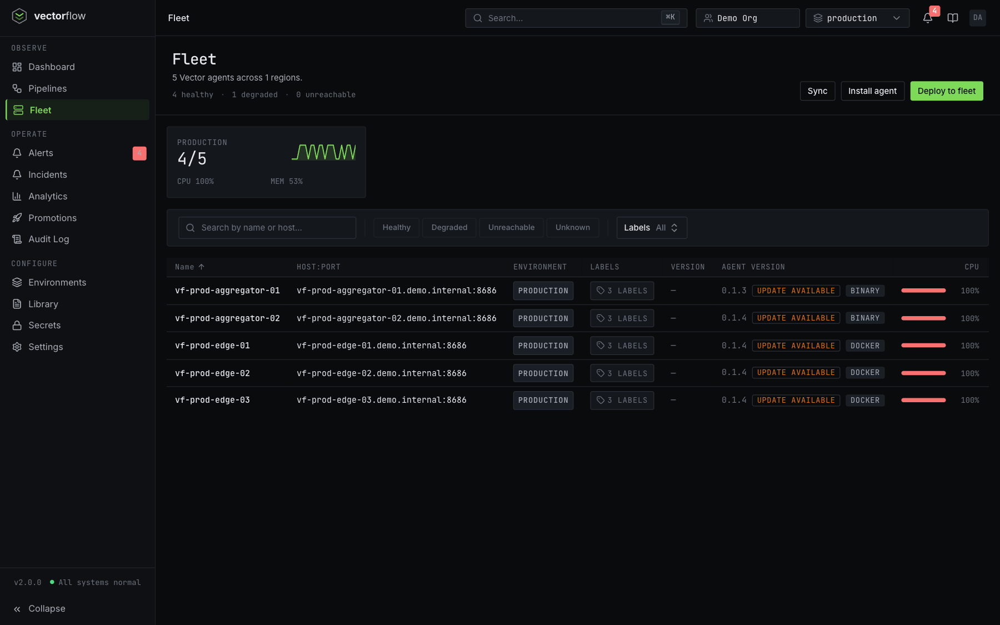
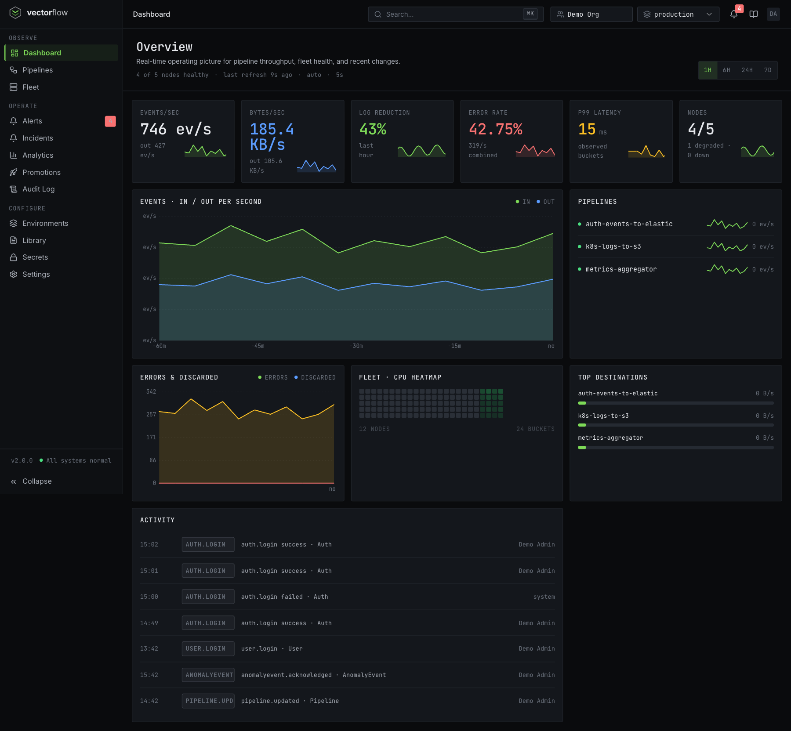

<div align="center">

<picture>
  <source media="(prefers-color-scheme: dark)" srcset="assets/logo-dark.svg">
  <source media="(prefers-color-scheme: light)" srcset="assets/logo-light.svg">
  
</picture>
<br><br>

[](https://github.com/TerrifiedBug/vectorflow/actions/workflows/ci.yml)
[](https://github.com/TerrifiedBug/vectorflow/releases)
[](LICENSE)
[](https://vectorflow.sh/docs)

Design, deploy, and monitor [Vector](https://vector.dev) data pipelines visually.

Stop hand-editing YAML. Build observability pipelines with drag-and-drop<br>and deploy them across your fleet from a single dashboard.

[Documentation](https://vectorflow.sh/docs) · [Quick start](https://vectorflow.sh/docs/getting-started/quick-start) · [Features](#features) · [Deployment](#deployment)

> 🌐 **[Try the live demo →](https://demo.vectorflow.sh)**

</div>

<br>

<p align="center">
  
</p>

## Why VectorFlow?

[Vector](https://vector.dev) is great at moving observability data around, but managing YAML configs across dozens of servers gets painful fast. VectorFlow is a self-hosted control plane that lets you build pipelines visually, push them to a fleet of agents, and monitor everything in real time.

- Self-hosted, open source, runs on your infrastructure. No vendor lock-in.
- Pull-based agents, so no inbound ports needed on fleet nodes.
- Per-pipeline process isolation. A crashed pipeline doesn't take down the others.

## Features

- **Visual pipeline editor** — drag-and-drop canvas with 100+ Vector components, schema-driven config forms, Monaco VRL editor with syntax highlighting, connection validation, and live event tapping
- **Fleet deployment** — one-click deploy with YAML diff preview; agents pull configs automatically with no SSH or Ansible needed
- **Real-time monitoring** — per-node and per-pipeline throughput, error rates, CPU, memory, disk, and network metrics with live event rates on the canvas
- **Version control & rollback** — immutable version snapshots, changelogs, side-by-side diffs, one-click rollback, and cross-environment promotion
- **Enterprise security** — OIDC SSO, TOTP 2FA, RBAC (Viewer/Editor/Admin per team), AES-256-GCM encrypted secrets, TLS cert storage, and immutable audit logs
- **Alerting & anomaly detection** — threshold-based rules on dozens of metrics, statistical anomaly baselines, and alert correlation; notifications via Slack, email, PagerDuty, and webhooks
- **Cost attribution** — per-pipeline, per-team, per-environment cost rollups with optimization recommendations
- **GitOps** — sync pipeline definitions from GitHub, GitLab, or Bitbucket with PR-based promotion; REST API and SCIM 2.0 for platform automation
- **AI debugging** — optional AI suggestions for failing pipelines using your own OpenAI or Anthropic key
- **Import/export** — import existing `vector.yaml` files, export as YAML/TOML, save reusable pipeline templates

<p align="center">
  
</p>

<p align="center">
  
</p>

## Deployment

### Server + Agent

```bash
cd vectorflow/docker/server
cp .env.example .env      # fill in POSTGRES_PASSWORD, NEXTAUTH_SECRET
docker compose up -d
```

After setup, sign in and generate an enrollment token under **Environments → (select your environment) → Agent Enrollment**. Add it to `.env` as `VF_ENROLLMENT_TOKEN`, then start the bundled agent: `docker compose --profile agent up -d`.

### Server + Agent + OpenSearch

An all-in-one stack that bundles OpenSearch and OpenSearch Dashboards:

```bash
cd vectorflow/docker/server
cp .env.example .env      # fill in POSTGRES_PASSWORD, NEXTAUTH_SECRET
docker compose -f docker-compose.opensearch.yml up -d
```

### Standalone Agent

To run the agent on a separate host:

```bash
cd vectorflow/docker/agent
cat > .env << 'EOF'
VF_URL=http://your-vectorflow-server:3000
VF_TOKEN=paste-enrollment-token-here
EOF
docker compose up -d
```

For high-availability, Helm charts, and production hardening, see the [deployment docs](https://vectorflow.sh/docs/operations/production-hardening). Alternative agent install methods (systemd, standalone binary, Kubernetes Helm) and all configuration options are covered in the [agent docs](https://vectorflow.sh/docs/reference/agent).

## VectorFlow Cloud

Prefer not to run the control plane yourself? **[VectorFlow Cloud](https://vectorflow.sh)** is a hosted, fully-managed version — same visual editor and fleet management, with the server, database, backups, and upgrades operated for you. Your agents still run on your own infrastructure and pull their config (no inbound ports). The self-hosted edition in this repo stays free and open source under AGPL-3.0.

## Contributing

Contributions are welcome. See [SECURITY.md](SECURITY.md) for reporting security vulnerabilities.

## License

VectorFlow is licensed under the [GNU Affero General Public License v3.0](LICENSE) (AGPL-3.0).

Copyright &copy; 2026 TerrifiedBug
