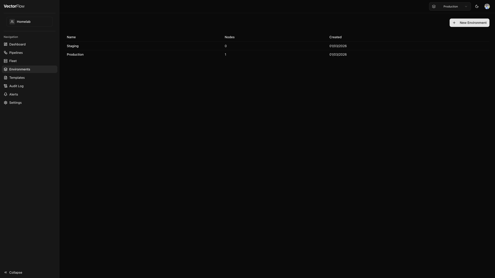

# Environments

Environments are isolated deployment contexts that let you separate your pipelines, agents, and secrets across lifecycle stages such as **development**, **staging**, and **production**. Each environment maintains its own independent set of resources, so changes in one environment never affect another.



## Why use environments?

- **Isolation** -- Keep experimental pipeline changes out of production.
- **Separate secrets** -- The same secret name (e.g., `API_KEY`) can hold different values in each environment.
- **Independent fleets** -- Agent nodes enroll into a specific environment and only run pipelines assigned to that environment.
- **Promotion workflow** -- Build and test a pipeline in dev, then promote it to staging and production when ready.

## Environment selector

The environment selector is the dropdown in the header bar. Switching it changes the global context for the entire application -- the pipeline list, fleet view, alerts, and all other pages update to show only resources belonging to the selected environment.


When you switch environments, the pipeline list, fleet view, and alerts page update to show only resources for that environment. Your selection is persisted across sessions.


## Creating an environment



### Open the Environments page
Navigate to **Environments** in the sidebar and click **New Environment**.


### Enter a name
Give the environment a descriptive name (e.g., "Production", "Staging", "Dev"). Names can be up to 100 characters.


### Create
Click **Create Environment**. You are redirected to the environments list where your new environment appears.



## Environment detail page

Click any environment name in the list to open its detail page. The detail view shows:

- **Overview cards** -- At-a-glance counts for agent nodes and pipelines assigned to this environment.
- **Vector Nodes table** -- All nodes registered in this environment with their name, host address, status, and last-seen timestamp. Click a node name to jump to its fleet detail page.
- **Agent Enrollment** -- Generate or revoke the enrollment token that agents use to connect to this environment.
- **Secret Backend** -- Configure how pipelines resolve secret references (see below).
- **Secrets & Certificates** -- Manage the secrets and TLS certificates available to pipelines in this environment.

You can edit the environment name or delete the environment from the detail page header.


Deleting an environment permanently removes all of its pipelines, nodes, and secrets. This action cannot be undone.


## Agent enrollment tokens

Before an agent can connect to an environment, you must generate an **enrollment token** on the environment detail page. The token is displayed once -- copy it immediately and provide it to the agent at startup:

```bash
VF_URL=https://your-vectorflow-instance:3000
VF_TOKEN=<enrollment-token>
./vf-agent
```

You can regenerate or revoke the token at any time. Revoking a token prevents new agents from enrolling, but already-connected agents continue operating until their individual node tokens are revoked from the Fleet page.

## Secret backends

Each environment can use a different backend for resolving secret references in pipeline configurations:

| Backend | Description |
|---------|-------------|
| **Built-in** | VectorFlow stores secrets internally and delivers them to agents as environment variables. This is the default. |
| **HashiCorp Vault** | Secrets are fetched from a Vault instance. Configure the Vault address, auth method (token, AppRole, or Kubernetes), and mount path. |
| **AWS Secrets Manager** | Secrets are resolved from AWS Secrets Manager at deploy time. |
| **Exec** | A custom script on the agent host is executed to retrieve secrets. |

## Secrets per environment

Secrets are scoped to individual environments. The same secret name can hold different values in each environment. For example, you might have an `ELASTICSEARCH_API_KEY` secret that points to a test cluster in your dev environment and a production cluster in your production environment.

Manage secrets from the **Secrets & Certificates** section on the environment detail page.

## Pipeline promotion

You can copy a pipeline from one environment to another using the **Promote to...** action on the Pipelines page. This is the recommended workflow for moving validated configurations through your lifecycle stages (e.g., dev to staging to production).


Secrets and certificates are stripped during promotion. After promoting a pipeline, configure the appropriate secrets in the target environment before deploying.


## Deploy approval

Environments can require **admin approval** before pipelines are deployed. This is useful for production environments where you want a second pair of eyes on every configuration change.

### Enabling approval



### Open environment settings
Navigate to **Environments**, click the environment name, and click **Edit**.


### Enable the toggle
Turn on **Require approval for deploys**.


### Save
Click **Save** to apply the change.



When enabled:
- Users with the **Editor** role will see a **Request Deploy** button instead of **Publish to Agents** in the deploy dialog. Their deploy requests are queued for review.
- Users with the **Admin** role can deploy directly (no approval needed) and can review, approve, or reject pending requests from other users.
- A **Pending Approval** badge appears on the pipeline list and in the pipeline editor toolbar while a request is outstanding.


An admin cannot approve their own deploy request. This ensures a genuine four-eyes review process.


For more details on how the approval workflow operates, see [Pipelines -- Deploy approval workflows](pipelines.md#deploy-approval-workflows).

## Editing and deleting environments

- **Edit** -- Click the **Edit** button on the environment detail page to rename the environment or change its secret backend configuration.
- **Delete** -- Click the **Delete** button to permanently remove the environment. You must have the Admin role on the team to delete an environment.

## Git Integration

VectorFlow can automatically commit pipeline YAML files to a Git repository whenever a pipeline is deployed or deleted. This provides an audit trail, version history, and hook points for external CI/CD workflows.

### Setup



### Navigate to Environment Settings
Go to **Environments** and click on the environment you want to configure.


### Configure Git Integration
In the **Git Integration** card, enter:
- **Repository URL**: The HTTPS URL of your Git repo (e.g., `https://github.com/org/pipeline-configs.git`)
- **Branch**: The branch to commit to (default: `main`)
- **Access Token**: A personal access token with write access to the repo


### Test Connection
Click **Test Connection** to verify VectorFlow can reach the repository.



### How It Works

When you deploy a pipeline, VectorFlow commits the generated YAML to `{environment-name}/{pipeline-name}.yaml` in the configured repository. When you delete a pipeline, the file is removed with a commit.


Git sync is a post-deploy side effect. If the Git push fails, the pipeline deploy still succeeds -- you will see a warning toast in the UI.


### GitOps Mode

Each environment has a **GitOps Mode** setting that controls the direction of Git synchronization:

| Mode | Description |
|------|-------------|
| **Off** | Git integration is disabled (default). |
| **Push Only** | Pipeline YAML is committed to the repo on deploy. Changes in git are not pulled back. |
| **Bi-directional** | Pipeline YAML is committed on deploy AND pushes to the repo trigger pipeline imports via webhook. |

When **Bi-directional** mode is enabled, a webhook URL and secret are generated. Configure these in your GitHub repository webhook settings to enable automatic pipeline imports on push. See the [GitOps guide](../operations/gitops.md) for detailed setup instructions.


In bi-directional mode the Git repository is the source of truth. Manual edits in the VectorFlow UI may be overwritten on the next push. The pipeline editor displays a banner to remind users of this.

