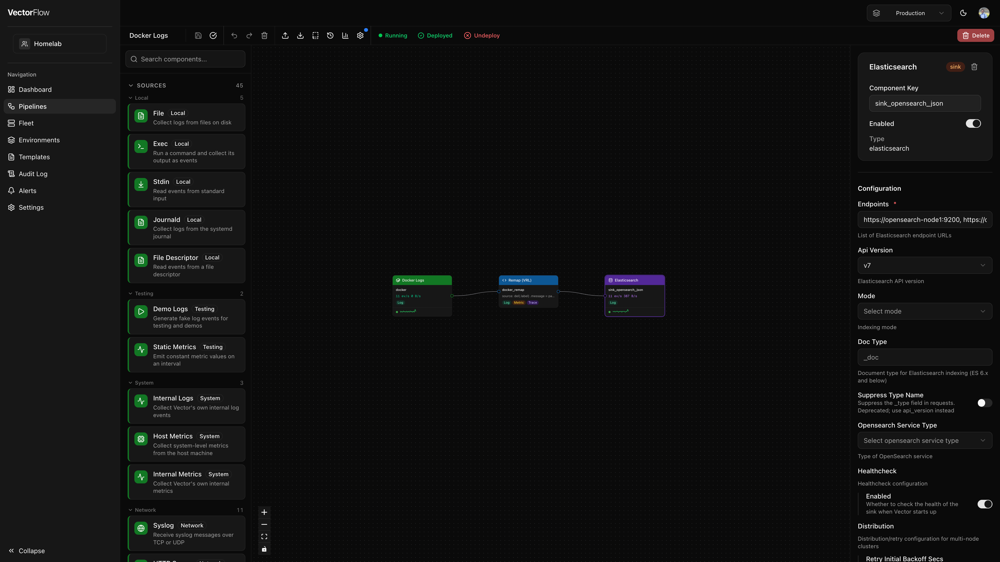
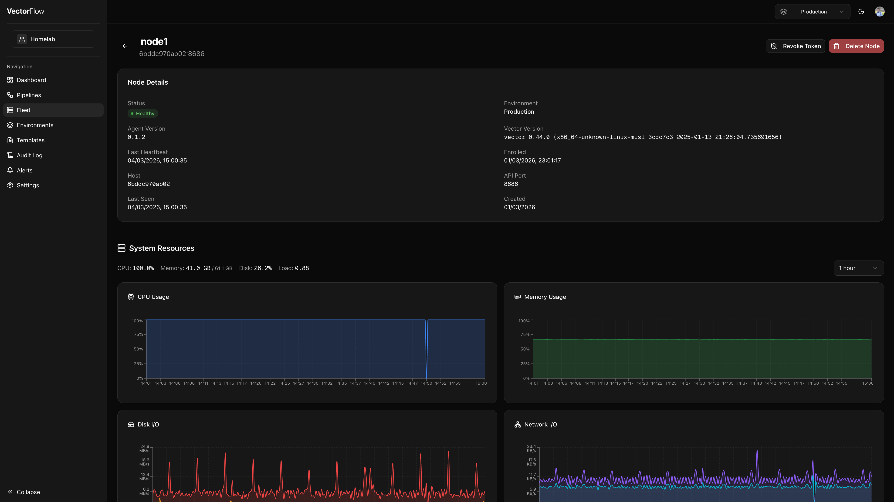

# Pipeline Editor

The pipeline editor is a visual canvas where you design data pipelines by connecting sources, transforms, and sinks. It provides a drag-and-drop interface powered by a flow-graph layout, so you can build and modify pipelines without writing configuration files by hand.

## Editor layout

The editor is divided into four main areas:

| Area | Location | Purpose |
|------|----------|---------|
| **Component Palette** | Left sidebar | Lists all available Vector component types, organized by kind and category. |
| **Canvas** | Center | The main workspace where you arrange and connect nodes. |
| **Detail Panel** | Right sidebar | Configuration form for the currently selected node. |
| **Toolbar** | Top bar | Actions for saving, validating, deploying, and managing the pipeline. |

## Component palette

The left sidebar has two tabs:

- **Catalog** -- Lists every available Vector component, grouped by kind (Sources, Transforms, Sinks). Each section can be collapsed and is further organized by category (e.g. "Cloud Platform", "Aggregating", "Messaging").
- **Shared** -- Lists [shared components](shared-components.md) available in the current environment. Filter by kind using the All / Source / Transform / Sink buttons.

Use the **search bar** at the top of the palette to filter components by name, type, description, or category. The search applies to whichever tab is active.

### Adding a component

Drag a component from the palette and drop it onto the canvas. A new node appears at the drop position, pre-configured with sensible defaults. You can also right-click the canvas to paste previously copied nodes.

Dragging a shared component from the **Shared** tab creates a **linked node** -- the node's configuration is pre-filled from the shared component and pinned to its current version. See [Shared Components](shared-components.md) for details on linked node behavior.

## Canvas

The canvas is where your pipeline takes visual shape. Each component is represented as a **node**, and data flow between components is represented as **edges** (connections).

### Interacting with the canvas

- **Pan** -- Click and drag on empty canvas space to move around.
- **Zoom** -- Use the scroll wheel or the zoom controls in the bottom-left corner.
- **Select a node** -- Click a node to select it. Its configuration appears in the detail panel on the right.
- **Multi-select** -- Hold Shift and click additional nodes to select multiple components at once. The detail panel shows bulk actions (Copy All, Delete All).
- **Reposition** -- Drag a node to move it to a new position on the canvas.
- **Connect nodes** -- Drag from a node's output port (right side) to another node's input port (left side) to create a connection. The editor enforces data-type compatibility and prevents self-connections.
- **Fit to view** -- The canvas automatically fits all nodes into view when first loaded. Use the zoom controls to reset the view.

### Context menus

- **Right-click a node** -- Opens a menu with Copy, Paste, Duplicate, Delete, and **Save as Shared Component** actions. The shared component option extracts the node's configuration into a reusable [shared component](shared-components.md) and links the node to it.
- **Right-click an edge** -- Opens a menu with a Delete connection action.

## Node types

### Sources

Sources are where data **enters** the pipeline. They have an output port on the right side and are color-coded green. Examples include:

- `syslog` -- Receive syslog messages over TCP or UDP
- `file` -- Tail log files from disk
- `kafka` -- Consume from Kafka topics
- `http_server` -- Accept events over HTTP
- `demo_logs` -- Generate synthetic log events for testing
- `datadog_agent`, `splunk_hec` -- Receive data from vendor agents

### Transforms

Transforms **process and modify** data as it flows through the pipeline. They have both an input port (left) and an output port (right), and are color-coded blue. Key types include:

- `remap` -- Apply VRL (Vector Remap Language) expressions to reshape events
- `filter` -- Drop events that do not match a VRL condition
- `sample` -- Randomly sample a percentage of events
- `route` -- Split events into multiple outputs based on VRL conditions
- `dedupe` -- Remove duplicate events based on field values
- `reduce` -- Aggregate multiple events into one
- `log_to_metric` -- Convert log events into metric data

### Sinks

Sinks are where data **exits** the pipeline to downstream destinations. They have an input port on the left side and are color-coded orange. Examples include:

- `elasticsearch` -- Send to Elasticsearch / OpenSearch
- `aws_s3` -- Write to Amazon S3 buckets
- `http` -- Forward over HTTP to any endpoint
- `console` -- Print to standard output (useful for debugging)
- `datadog_logs`, `splunk_hec_logs` -- Send to vendor platforms
- `kafka` -- Produce to Kafka topics
- `loki` -- Send to Grafana Loki

### Live metrics on nodes

When a pipeline is deployed, each node displays live throughput metrics directly on the canvas:

- **Events per second** and **bytes per second** in a compact readout
- A **status dot** indicating health (green for healthy, amber for degraded)
- A **sparkline** showing recent throughput trends

## Detail panel

Click any node on the canvas to open its configuration in the detail panel on the right.

The panel has two tabs:

- **Config** -- The component configuration form (always visible).
- **Live Tail** -- Sample live events flowing through the component (visible only when the pipeline is deployed). See [Live Tail](#live-tail) below.

The **Config** tab shows:

- **Component name and kind** -- The display name, a badge indicating source/transform/sink, and a delete button.
- **Name** -- A human-readable label for the component (e.g. "Traefik Logs"). Changing the name requires saving, but does not require a redeploy.
- **Component ID** -- An auto-generated unique identifier used in the backend configuration (read-only). This key is set when the node is created and never changes.
- **Enabled toggle** -- Disable a component to exclude it from the generated configuration without removing it from the canvas.
- **Type** -- The Vector component type (read-only).
- **Configuration form** -- Auto-generated form fields based on the component's configuration schema. Required fields are marked, and each field has contextual help.
- **Secret picker** -- Sensitive fields (passwords, API keys, tokens) display a secret picker instead of a text input. You must select an existing secret or create a new one inline -- plaintext values cannot be entered directly into sensitive fields. See [Security](../operations/security.md#sensitive-fields) for details.

### Linked shared components

When a node is linked to a [shared component](shared-components.md), the detail panel shows additional elements:

- A **purple banner** with the shared component name and an "Open in Library" link.
- **Read-only configuration** -- All config fields are disabled. Edits must be made on the shared component's Library page.
- An **Unlink** button to convert the node back to a regular editable component (the current config snapshot is preserved).
- When the shared component has been updated since the node was last synced, an **amber update banner** appears with an "Accept update" button to pull in the latest configuration.

### VRL editor for transforms

For **remap**, **filter**, and **route** transforms, the detail panel includes an integrated VRL editor (powered by Monaco) instead of a plain text field. The VRL editor provides:

- Syntax highlighting for VRL code
- Autocomplete for VRL functions
- An inline snippet drawer to insert common VRL patterns (see [VRL Snippets](vrl-snippets.md))
- A fields panel showing the schema of upstream source events
- A test runner that lets you execute your VRL code against sample JSON events and see the output

## Toolbar

The toolbar runs along the top of the editor and provides the following actions (left to right):

| Action | Shortcut | Description |
|--------|----------|-------------|
| **Save** | `Cmd+S` | Save the current pipeline state. A dot indicator appears when there are unsaved changes. |
| **Validate** | -- | Run server-side validation on the generated Vector configuration and report any errors. |
| **Undo** | `Cmd+Z` | Undo the last change. |
| **Redo** | `Cmd+Shift+Z` | Redo a previously undone change. |
| **Delete** | `Delete` | Delete the currently selected node or edge. |
| **Import** | `Cmd+I` | Import a Vector configuration file (YAML or TOML) to populate the canvas. |
| **Export** | `Cmd+E` | Export the pipeline as a YAML or TOML file. |
| **Save as Template** | -- | Save the current pipeline layout as a reusable template. |
| **Version History** | -- | View all deployed versions, compare diffs, and rollback to a previous version. |
| **Discard Changes** | -- | Revert the pipeline to its last deployed configuration. Only visible when the pipeline is deployed and has unsaved changes. |
| **Metrics** | -- | Toggle the metrics chart panel at the bottom of the editor. |
| **Logs** | -- | Toggle the live logs panel. A red dot appears when recent errors have been detected. |
| **Settings** | -- | Open pipeline-level settings (log level, global configuration). A blue dot indicates active global config. |

### Pipeline settings

Click the **Settings** button in the toolbar to open the pipeline settings panel. Available options include:

- **Log Level** -- Sets the Vector log verbosity for this pipeline (`trace`, `debug`, `info`, `warn`, `error`).
- **Metadata Enrichment** -- When enabled, VectorFlow automatically injects a `vectorflow_metadata_enrich` remap transform before every sink at deploy time. This adds two fields to every event:
  - `.vectorflow.environment` -- the name of the environment the pipeline is deployed in.
  - `.vectorflow.pipeline_version` -- the version number of this deployment.
- **Classification Tags** -- Assign data classification labels (e.g. PII, PCI-DSS) to the pipeline.
- **Global Configuration (JSON)** -- Advanced Vector configuration such as enrichment tables.
- **Health SLIs** -- Define service-level indicators to monitor pipeline health.


The metadata enrichment transform is invisible in the editor canvas. It is only injected into the generated Vector config at deploy time, so you will see it in the deploy preview diff but not as a node on the canvas.


### Deploy and undeploy

The right side of the toolbar shows the current deployment state:

- **Deploy** button -- Appears when the pipeline has never been deployed, or when changes have been made since the last deployment. Clicking Deploy first auto-saves, then opens the deploy dialog.
- **Deployed** indicator -- A green checkmark shown when the deployed configuration matches the saved state.
- **Undeploy** button -- Stops the pipeline on all agents and reverts it to draft status. You can redeploy at any time.
- **Process status** -- A colored dot and label showing the runtime status: Running (green), Starting (yellow), Stopped (gray), or Crashed (red).

## Pipeline logs panel

Toggle the logs panel from the toolbar to view real-time logs from the running pipeline. The panel supports:

- **Level filtering** -- Toggle visibility of ERROR, WARN, INFO, DEBUG, and TRACE log levels using the badges in the toolbar.
- **Search** -- Type in the search box to filter loaded log lines by keyword. Matching text is highlighted in yellow. The line counter updates to show how many lines match (e.g., "42/318 lines").
- **Node filtering** -- When viewing logs for a pipeline running on multiple nodes, filter by specific agent node.
- **Pagination** -- Scroll to the top to automatically load older log entries, or click **Load older** to fetch the next page.


Search filters the logs that are already loaded in the browser. It does not query the server — to find older log entries, load more pages first, then search.



The logs panel only shows data for deployed pipelines. Draft pipelines have no running processes to produce logs.


## Live Tail

Live Tail lets you sample real events flowing through any component in a deployed pipeline, directly from the detail panel. This is useful for verifying that data is being ingested, transformed, and routed as expected.

### How to use Live Tail




### Deploy the pipeline
Live Tail requires a running pipeline. If the pipeline is still a draft, deploy it first using the **Deploy** button in the toolbar.



### Select a component
Click any node on the canvas to open the detail panel.



### Switch to the Live Tail tab
In the detail panel, click the **Live Tail** tab. This tab only appears for deployed pipelines.



### Sample events
Click **Sample 10 Events** to request a batch of live events from the selected component. The panel polls for results and displays them as they arrive.




Each sampled event appears as a collapsed row showing a JSON preview. Click any row to expand it and view the full event payload with formatted JSON.

- Events are shown newest-first, and the panel retains up to 50 events across multiple sampling requests.
- Each sampling request has a two-minute expiry. If no events are captured within that window, the request expires silently.
- You can sample from any component type -- sources, transforms, or sinks.


Live Tail uses the agent's event sampling infrastructure. The agent captures a snapshot of events passing through the selected component and returns them on its next heartbeat. There is no persistent stream -- each click of "Sample 10 Events" triggers a new one-shot capture.


## Pipeline rename

Click the pipeline name in the top-left corner of the editor to rename it inline. Press Enter to confirm or Escape to cancel.

## Keyboard shortcuts

| Shortcut | Action |
|----------|--------|
| `Cmd+S` | Save pipeline |
| `Cmd+Z` | Undo |
| `Cmd+Shift+Z` | Redo |
| `Cmd+C` | Copy selected node(s) |
| `Cmd+V` | Paste copied node(s) |
| `Cmd+D` | Duplicate selected node |
| `Cmd+E` | Export configuration |
| `Cmd+I` | Import configuration |
| `Delete` / `Backspace` | Delete selected node or edge |


On Windows and Linux, use `Ctrl` instead of `Cmd` for all keyboard shortcuts.

