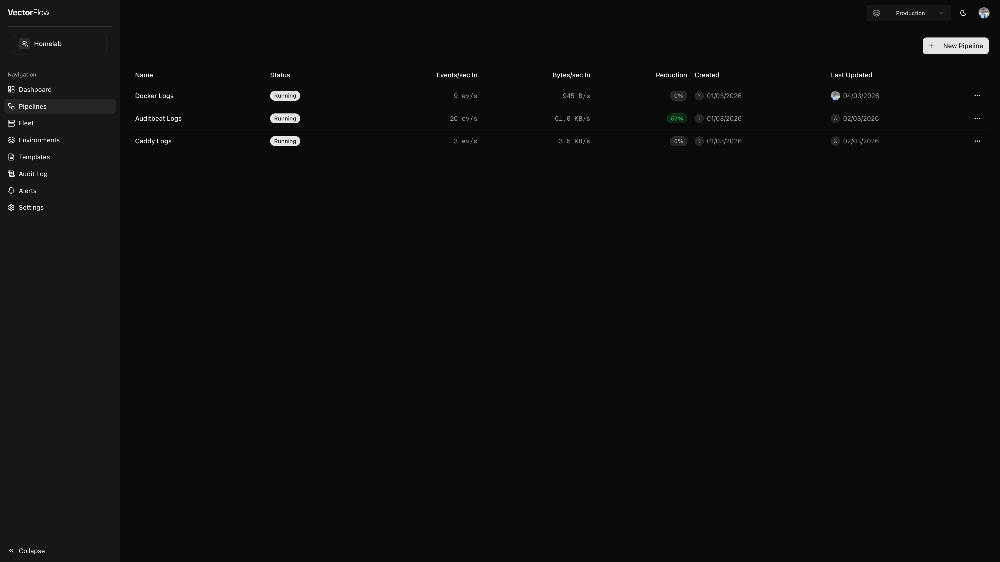

# Pipelines

The **Pipelines** page lists all pipelines in the currently selected environment. From here you can create, clone, promote, and delete pipelines, as well as monitor their live throughput at a glance.

## Pipeline list

Pipelines are displayed in a table with the following columns:

| Column | Description |
|--------|------------|
| **Name** | The pipeline name. Click it to open the pipeline in the editor. |
| **Status** | Current lifecycle state (see statuses below). |
| **Events/sec In** | Live event ingestion rate polled from the agent fleet. |
| **Bytes/sec In** | Live byte ingestion rate. |
| **Reduction** | Percentage of events reduced by transforms, color-coded green (>50%), amber (>10%), or neutral. |
| **Created** | Date and avatar of the user who created the pipeline. |
| **Last Updated** | Date and avatar of the user who last modified the pipeline. |

## Pipeline statuses

A pipeline moves through several states during its lifecycle:

- **Draft** -- The pipeline has been created but never deployed. It exists only as a saved configuration.
- **Running** -- The pipeline is deployed and actively processing events on at least one agent node.
- **Starting** -- The pipeline was recently deployed or restarted and agents are bringing it online.
- **Stopped** -- The pipeline is deployed but all agent nodes have stopped processing it.
- **Crashed** -- One or more agent nodes report that the pipeline has crashed. Check the pipeline logs for details.
- **Pending deploy** -- Shown as an additional badge when the saved configuration differs from what is currently deployed. Deploy the pipeline to push the latest changes.

## Creating a pipeline



### Click New Pipeline
Click the **New Pipeline** button in the top-right corner. This navigates you to a new, empty pipeline in the editor.


### Name your pipeline
Give the pipeline a descriptive name. Names must start with a letter or number and can contain letters, numbers, spaces, hyphens, and underscores (up to 100 characters).


### Build and save
Add sources, transforms, and sinks in the pipeline editor. Save your work -- the pipeline starts as a **Draft** until you deploy it.



## Pipeline actions

Each pipeline row has an actions menu (the three-dot icon on the right) with the following options:

- **Metrics** -- Opens the dedicated metrics page for the pipeline, showing detailed throughput and error charts.
- **Clone** -- Creates a copy of the pipeline (with " (Copy)" appended to the name) in the same environment and opens it in the editor.
- **Promote to...** -- Copies the pipeline to a different environment within the same team. This is useful for promoting a pipeline from development to staging or production. Secrets and certificates are stripped during promotion and must be re-configured in the target environment.
- **Delete** -- Permanently deletes the pipeline and all of its versions.


Deleting a deployed pipeline will automatically **undeploy** it from all agents before deletion. This means running agents will stop processing the pipeline on their next configuration poll. This action cannot be undone.


## Versioning

Every time you deploy a pipeline, a new **version** is created that captures the full configuration YAML and a changelog entry. Versions let you:

- **View history** -- See a list of all previously deployed versions with timestamps and the user who deployed them.
- **Compare changes** -- View diffs between any two versions to understand what changed.
- **Rollback** -- Restore a previous version if a deployment causes issues.

The pipeline list shows a **Pending deploy** badge when the saved configuration differs from the most recently deployed version, so you always know if there are undeployed changes.

## Filtering by environment

Pipelines are scoped to the currently selected **environment** (shown in the sidebar). Switch environments to view pipelines in a different environment. Each environment maintains its own independent set of pipelines, agent nodes, and secrets.
